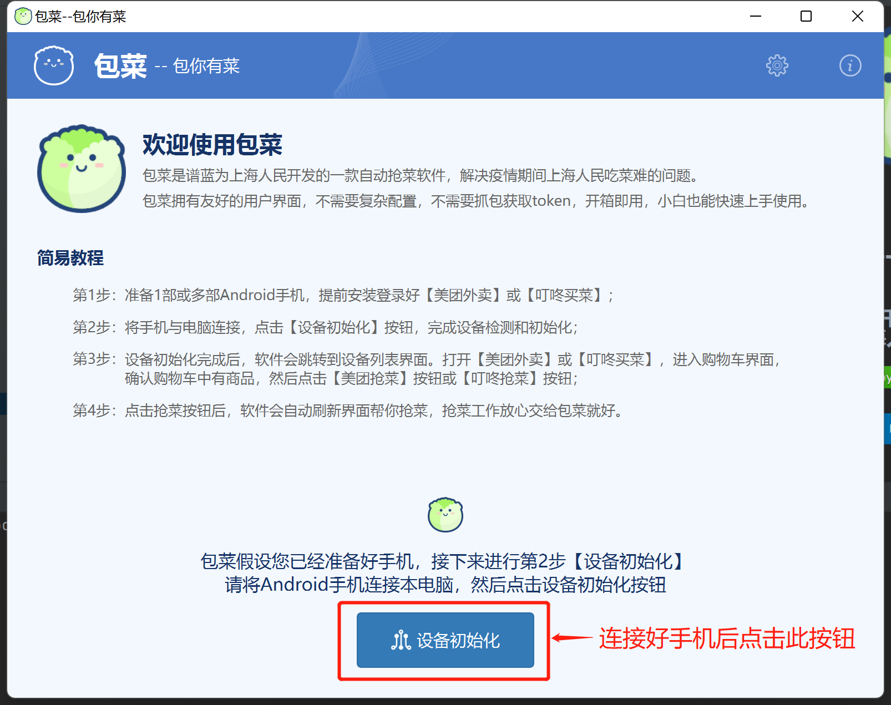
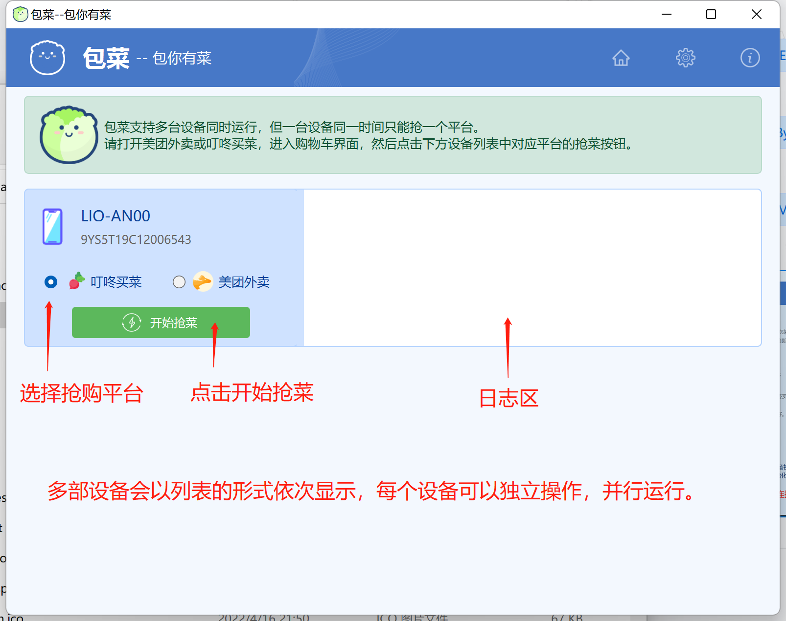
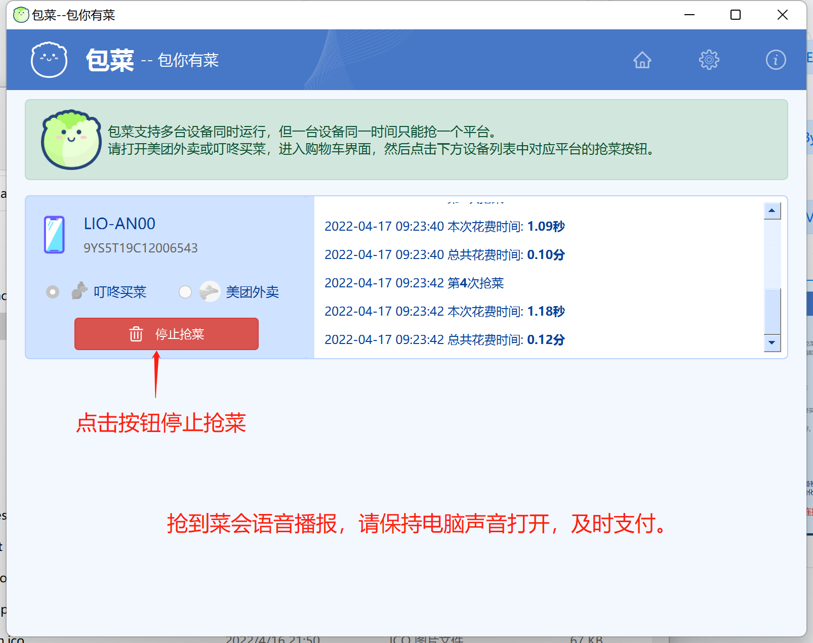
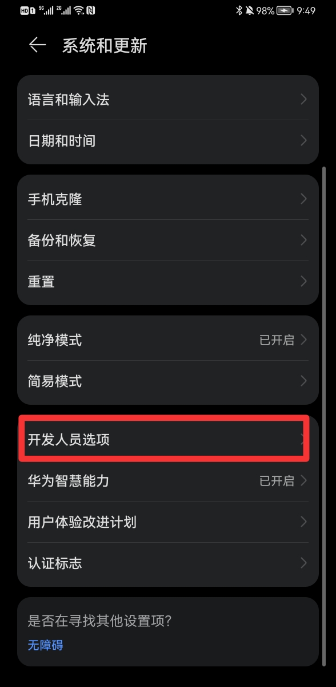
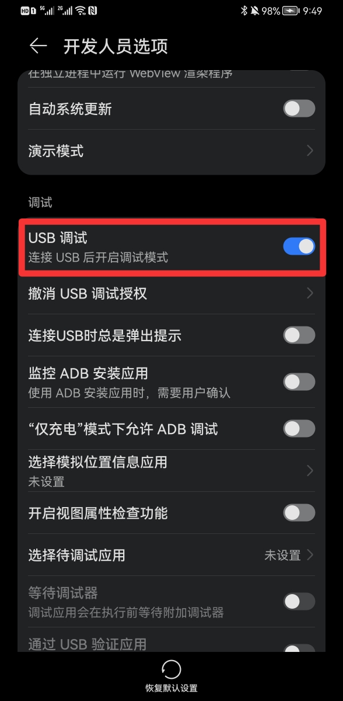
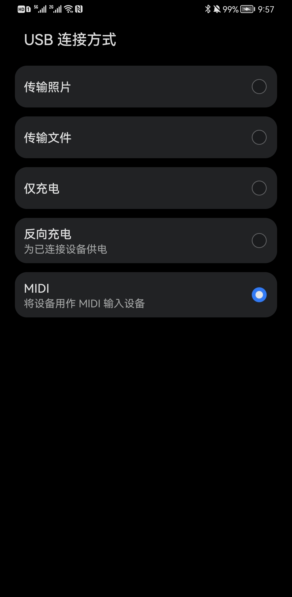
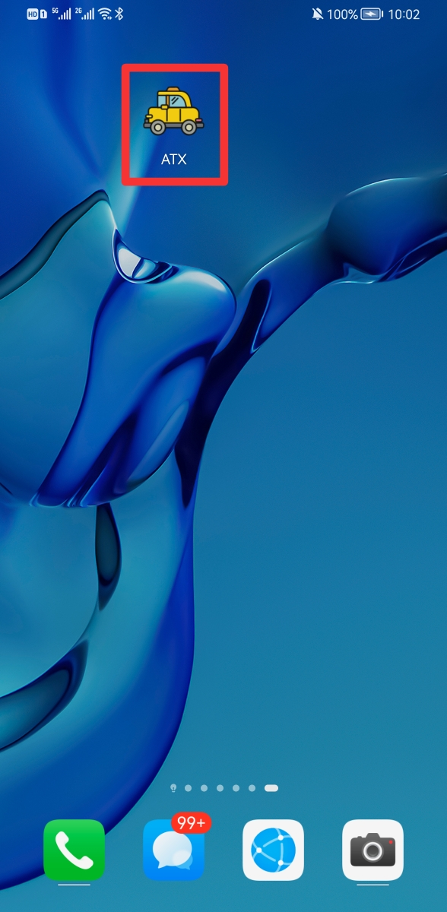

<h1 align="center" style="border-bottom: none;">包菜 <small>-- 包你有菜</small></h1>
<h3 align="center">包菜是谱蓝为上海人民开发的一款自动抢菜软件，解决疫情期间上海人民吃菜难的问题。</h3>

    
    
    
    
    

:octocat::octocat:

## 背景

事情的起因是这样的：上海疫情导致物资紧张、配送困难，抢菜成为上海人民的日常主题。有朋友抱怨抢不到菜，于是几个小伙伴撸了一个自动抢菜的程序帮大家抢菜。

这个抢菜程序很有效，但是缺点是环境配置复杂，还需要抓包获取Token，不懂技术根本用不起来。于是我开发了这个给小白使用的抢菜软件。它具有如下优点：

- 具有友好的图形界面；
- 使用简单，无需配置环境，无需抓包获取Token；
- 支持多设备同时抢菜；
- 支持叮咚、美团双平台；
- 支持Window和Mac操作系统；
- 免费、开源。

## 简易教程

首先你需要准备一台电脑（Windows或Mac）和至少一部Android手机（用Android模拟器也行，推荐 [MUMU模拟器](https://mumu.163.com/mac/index.html) 或 [夜神模拟器](https://www.yeshen.com/) ）。

### 第一步

打开”包菜“，将手机连接电脑，点击 **初始化设备** 按钮。

### 第二步

设备初始化完成后，软件会跳转到设备列表界面。

手机上打开美团外卖或叮咚买菜，进入购物车界面，然后点击 **开始抢菜** 按钮。

### 第三步
抢到菜后软件会播报声音，请及时支付。

软件运行过程中，你可以随时停止抢菜进程。

## 常见问题

### 1. 设备初始化失败

这是由于手机和电脑未正确连接导致的。包菜操控手机需要打开 **开发者模式 -- USB调试**，如下图：

不同型号手机开启USB调试的方法不同，具体请参考: 

- [华为手机开启USB调试](https://zhuanlan.zhihu.com/p/429854110) 
- [小米手机开启USB调试](https://www.bkqs.com.cn/content/zn2o02qpy.html) 
- [OPPO手机开启USB调试](https://blog.csdn.net/weixin_31100713/article/details/117644271)  
- [VIVO手机开启USB调试](https://www.jy135.com/shouji/162712.html) 
- [三星手机开启USB调试](https://www.jy135.com/shouji/336013.html) 

### 2. 开启了USB调试还是无法初始化设备

这可能是手机与电脑的连接模式不对。以华为手机为例，手机与电脑连接后默认是”仅充电模式“。此时需要下来展开系统通知菜单，点击”正在通过USB充电“，在弹出的USB连接方式菜单中选择”MIDI“。

### 3. 为什么会在我手机上安装ATX？

包菜操控手机上的软件需要一个代理，ATX就是这个代理应用。ATX来自测试框架 [uiautomator2](https://github.com/openatx/uiautomator2) ，
uiautomator2是开源项目，安全可靠，没有后门，大家可以放心安装。

## 声明

**请合理使用本软件，不要恶意抢夺资源。**

包菜的理念是让人人有菜吃。但作者深知一旦人人都用上抢菜软件，就会陷入无尽的内卷，最终在供给得不到有效提升的情况下，大家又都抢不到菜了。所以请在真的有需要的时候小范围使用，不要大规模传播。

最后，希望上海疫情尽在过去，愿上海人民不在需要抢菜！